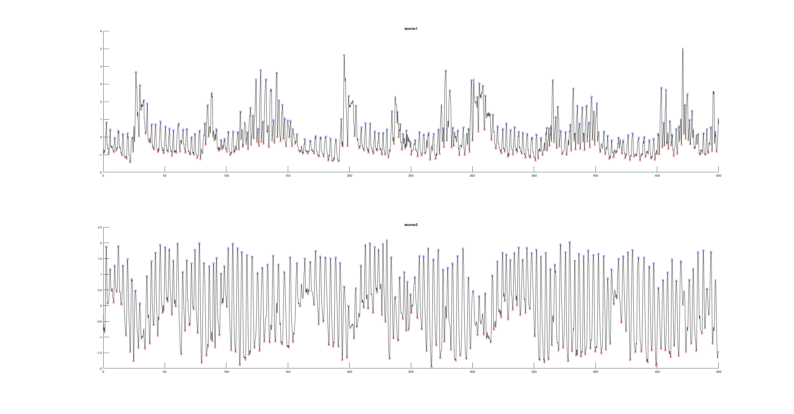
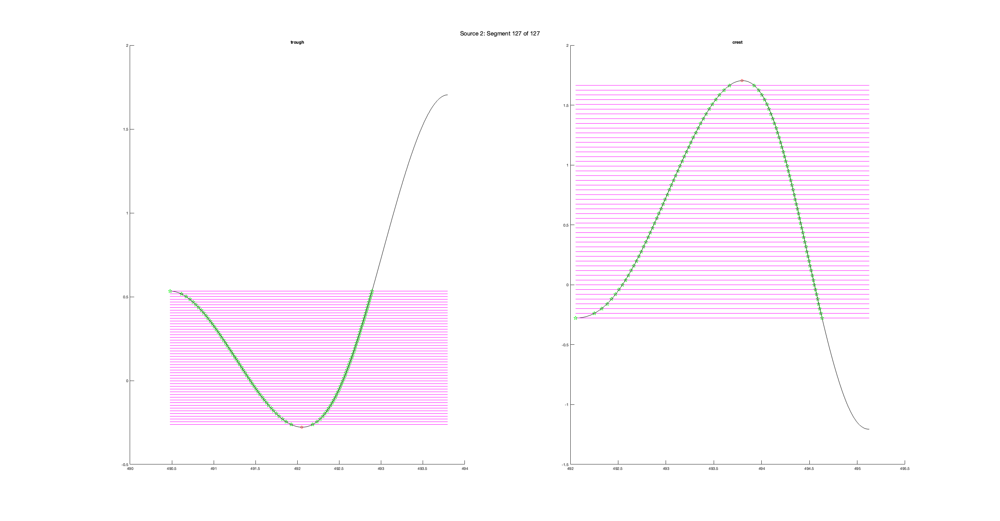

# resp-features

.

## General Algorithm

1. Independent Component Analysis (ICA)
2. Empirical Mode Decomposition (EMD) Filtering
3. Segmentation
4. Morphological Featuers
5. Fuzzy Wavelet Packet Transform (FWPT) Features 
6. SVM Classifier
7. Model Evaluation

## generate_features.m

### 1. ICA

.

### 2. EMD

.

### 3. Segmentation

We generate create feature vectors out of "segments" of a signal. These segments are defined as.. 

### 4. Morphological Features

Contributes a total of 100 features per segment. 

### 5. FWPT Features

Contributes a total of 510 features per segment. 

## resp_classifier.m

### 6. Support Vector Machine (SVM)

.

### 7. Evaluation 

.

## Helper Functions

### ICA

We used the ICA process implemented earlier this semester. [Link to code.](https://github.com/gustybear-research/x96_multi_moda_p_verf_osa/tree/main/ICA_analysis)

### EMD

We used the EMD process implemented earlier this semester. [Link to code.](https://github.com/davidvliang/emd-analysis)

### Intersections

[Link to MATLAB documentation here.](https://www.mathworks.com/matlabcentral/fileexchange/11837-fast-and-robust-curve-intersections)

### getmswpfeat

Implemented in [1]. Detailed discussion in [2]. [Beginner-friendly tutorial](./Helpers/getmswpfeat/Tutorial_Feature%20Extraction%20Using%20Multisignal%20Wavelet%20Packet.pdf) is provided. [Link to MATLAB documentation here.](https://www.mathworks.com/matlabcentral/fileexchange/33146-feature-extraction-using-multisignal-wavelet-packet-decomposition)

## References

[1] J. Liu, Y. Chen, Y. Dong, Y. Wang, T. Zhao and Y. -D. Yao, "Continuous User Verification via Respiratory Biometrics," IEEE INFOCOM 2020 - IEEE Conference on Computer Communications, Toronto, ON, Canada, 2020, pp. 1-10, doi: 10.1109/INFOCOM41043.2020.9155258. [Link to PDF.](./Reference/Liu_et_al._-_2020_-_Continuous_User_Verification_via_Respiratory_Biome_2.pdf)

[2] R. N. Khushaba, S. Kodagoa, S. Lal, and G. Dissanayake, “Driver Drowsiness Classification Using Fuzzy Wavelet Packet Based Feature Extraction Algorithm”, IEEE Transaction on Biomedical Engineering, vol. 58, no. 1, pp. 121-131, 2011. [Link to PDF.](./Reference/khushaba2011.pdf)